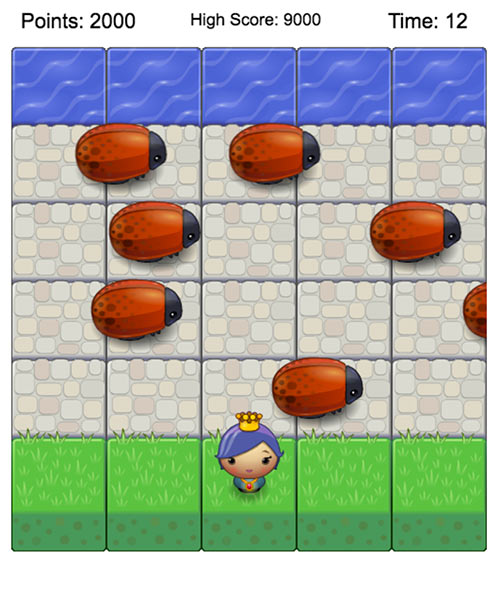

Udacity Front-End Nanodegree Arcade Game
===============================

[Stampede](https://github.com/jonwonglam/frontend-nanodegree-arcade-game) is a Frogger Clone built during the [Udacity Front-End Nanodegree](https://www.udacity.com/course/front-end-web-developer-nanodegree--nd001) course. You play as a princess who's land has been overrun by stampeding bugs. You must escape your land and get points each time you make it the ocean without being crushed. What happened to everyone else? Who knows...

# Quickstart

#### Install
Download the repo zip or clone using:

`git clone https://github.com/jonwonglam/frontend-nanodegree-arcade-game.git`

Open `index.html` to load the game.

# Gameplay
Get points by getting your character to the other side without getting hit by a bug. When you get to the other side you get 1000 points. Being hit by a bug brings your points down to 0. The bugs move faster the more points you have.

#### Controls
Left/Right/Up/Down arrows move the character around.

# About the Game
Stampede was created using Javascript coupled with HTML5's canvas feature. Udacity provided [starter code](https://github.com/udacity/frontend-nanodegree-arcade-game) that included sprites, a basic game engine, and the level design.

#### Goal
The goal of this project was to practice using the Pseudoclassical pattern to create classes in Javascript. The classes in this game include the player and enemy objects.
